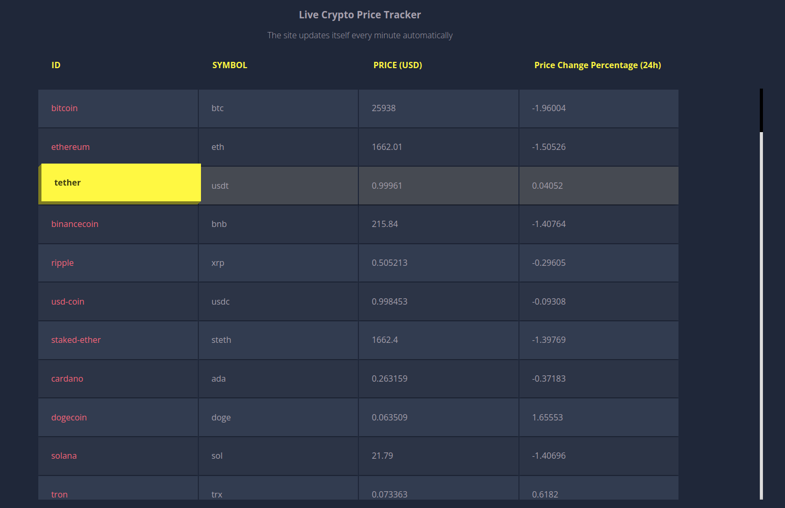

# Live Cryptocurrency Price Tracker

A real-time application that tracks and displays the latest prices of the top 100 cryptocurrency coins.

## Table of Contents

- [Description](#description)
- [Demo](#demo)
- [Technologies](#technologies)
- [Installation](#installation)
- [Usage](#usage)
- [Features](#features)
- [Contributing](#contributing)
- [License](#license)
- [Contact](#contact)

## Description

The Live Cryptocurrency Price Tracker is a web application built with Vite.js and React. It provides real-time updates on the prices of the top 100 cryptocurrencies, helping users stay informed about the cryptocurrency market.

**Key Features:**

- Real-time price updates.
- Caching mechanism to handle API rate limits.
- Custom hook for data fetching.

## Demo

Check out the [Live Demo](https://crypto-tracker-mu-sepia.vercel.app/) to see the application in action.

## Technologies

- Vite.js
- React
- HTML/CSS

## Installation

1. Clone the repository: `git clone https://github.com/AnuragYadav404/crypto-tracker.git`
2. Change to the project directory: `cd your-repo`
3. Install dependencies: `npm install`
4. Start the development server: `npm run dev`
5. During development and testing, the project uses a custom mocking function called `myFetch` to simulate API responses, ensuring efficient and controlled API handling.

## Usage

1. Open the app in your browser.
2. Explore the live cryptocurrency price updates.
3. During development and testing, the project utilizes a custom mocking function called `myFetch` to simulate API responses, ensuring smooth testing and development workflows.

## Features

- Real-time price tracking.
- Caching mechanism to handle API rate limits.
- Custom mocking function called `myFetch` to simulate `fetch` API responses , ensuring smooth testing and development workflows.

## Contributing

We welcome contributions from the community! If you'd like to contribute, please follow these guidelines:

1. Fork the repository and create a new branch.
2. Make your changes and submit a pull request.
3. Be sure to follow our code of conduct.

## License

This project is licensed under the MIT License - see the [LICENSE.md](LICENSE.md) file for details.

## Contact

If you have any questions or feedback, feel free to contact us at [yadav.anurag862@gmail.com] or open an issue on the GitHub repository.
